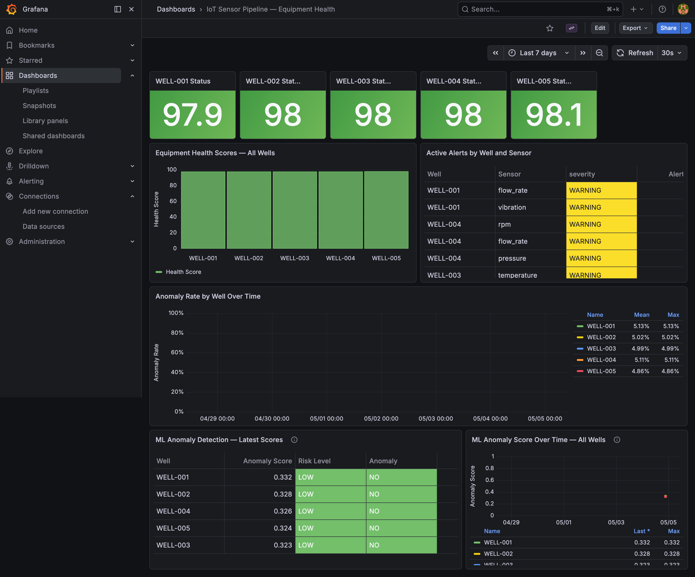

# 🛢️ Oil & Gas IoT Sensor Pipeline


A production-style, end-to-end data engineering and ML pipeline that simulates real-time sensor telemetry from oilfield equipment. Sensor readings stream through Apache Kafka, land in a local S3-compatible data lake (MinIO), get transformed by PySpark through a Bronze-Silver-Gold medallion architecture, orchestrated hourly by Apache Airflow, scored by an Isolation Forest anomaly detection model, and visualised live in Grafana.

---

## Dashboard



---

## Architecture

```
┌─────────────────────────────────────────────────────────────────┐
│                        INGESTION LAYER                          │
│                                                                 │
│   Sensor Simulator (Python)                                     │
│   5 wells × 5 sensors × every 5s = 300 msgs/min                 │
│          │                                                      │
│          ▼                                                      │
│   Apache Kafka  ←──────── topic: sensor-readings                │
│          │                                                      │
│          ▼                                                      │
│   Kafka Consumer → batches every 30s or 100 msgs                │
└──────────────────────────┬──────────────────────────────────────┘
                           │
                           ▼
┌─────────────────────────────────────────────────────────────────┐
│                     STORAGE LAYER (MinIO)                       │
│                                                                 │
│   Bronze: raw-sensor-data/year=/month=/day=/hour=/              │
│           Raw NDJSON, append-only, full audit trail             │
│                          │                                      │
│   Silver: silver/sensor_readings/year=/month=/day=/             │
│           Cleaned Parquet, schema enforced, anomalies flagged   │
│                          │                                      │
│   Gold:   gold/equipment_health/year=/month=/day=/hour=/        │
│           KPIs, health scores, alert summaries                  │
└──────────────────────────┬──────────────────────────────────────┘
                           │
                           ▼
┌─────────────────────────────────────────────────────────────────┐
│               ORCHESTRATION (Apache Airflow)                    │
│                                                                 │
│   DAG: iot_sensor_pipeline  │  Schedule: hourly at :05          │
│                                                                 │
│   check_bronze_data                                             │
│          │                                                      │
│          ▼                                                      │
│   bronze_to_silver  (PySpark)                                   │
│          │                                                      │
│          ▼                                                      │
│   silver_to_gold    (PySpark)                                   │
│          │                                                      │
│          ▼                                                      │
│   score_anomalies   (Isolation Forest ML)  ◄─── NEW             │
│          │                                                      │
│          ▼                                                      │
│   pipeline_summary  (PostgreSQL check)                          │
└──────────────────────────┬──────────────────────────────────────┘
                           │
                           ▼
┌─────────────────────────────────────────────────────────────────┐
│              WAREHOUSE + VISUALISATION                          │
│                                                                 │
│   PostgreSQL <- well_health, sensor_alerts, ml_anomaly_scores    │
│          │                                                      │
│          ▼                                                      │
│   Grafana Dashboard (auto-refreshes every 30s)                  │
└─────────────────────────────────────────────────────────────────┘
```

---

## ML Anomaly Detection Layer

An Isolation Forest model is trained on Silver layer Parquet data and scores all 5 wells after each hourly pipeline run. Results are written to PostgreSQL and displayed in the Grafana dashboard.

### Model

| Property | Value |
|---|---|
| Algorithm | Isolation Forest |
| Features | avg_pressure, avg_temperature, avg_flow_rate, avg_vibration, avg_rpm |
| Contamination | 0.05 (matches simulator's 5% anomaly rate) |
| Training data | Silver layer Parquet + synthetic fault hours (200h) |
| ROC-AUC | 0.997 |
| Precision (anomaly class) | 0.94 |
| Accuracy | 0.95 |
| Experiment tracking | MLflow |

### Why Isolation Forest (not a supervised classifier)?

In production, labels generated by a simulator are not trustworthy ground truth - real anomalies are defined by domain experts reviewing historical incidents. Isolation Forest learns the shape of normal sensor operation without relying on labels, making it directly transferable to real oilfield data where labels don't exist. The simulator's `is_anomaly` flag is used only for evaluation, not training.

### Scoring output per well

```json
{
  "well_id": "WELL-001",
  "is_anomaly": false,
  "anomaly_score": 0.3323,
  "risk_level": "LOW",
  "health_score": 97.9,
  "top_sensors": [
    { "sensor": "avg_pressure",    "deviation": 0.2523 },
    { "sensor": "avg_temperature", "deviation": 0.2085 },
    { "sensor": "avg_flow_rate",   "deviation": 0.1561 }
  ]
}
```

Risk levels: `LOW` < 0.50 · `MEDIUM` 0.50–0.55 · `HIGH` > 0.55

### API endpoints

The anomaly detection model is also exposed as a FastAPI service on port 8001:

| Endpoint | Description |
|---|---|
| `GET /health` | Service health check |
| `GET /anomaly/{well_id}` | Score a single well |
| `GET /anomaly` | Score all wells, sorted by risk |

Start the API:

```bash
cd ml
python api.py
```

---

## Simulated Sensors

5 oilfield wells, each emitting readings every 5 seconds across 5 sensor types:

| Sensor      | Unit  | Normal Range | Anomaly Range |
|-------------|-------|--------------|---------------|
| Pressure    | PSI   | 800 – 1200   | > 1400        |
| Temperature | °C    | 60 – 90      | > 110         |
| Flow Rate   | m³/hr | 50 – 150     | < 20          |
| Vibration   | mm/s  | 0.5 – 3.0    | > 5.0         |
| RPM         | rpm   | 1200 – 1800  | < 800         |

Anomalies are injected at ~5% probability using a normal distribution - not flat random - to simulate realistic sensor behaviour.

---

## Medallion Architecture

| Layer      | Location           | What happens |
|------------|--------------------|---|
| **Bronze** | `raw-sensor-data/` | Raw NDJSON events as-is from Kafka. No transformation. Full audit trail. Date-partitioned by ingest time. |
| **Silver** | `silver/`          | Schema enforced, nulls handled, duplicates removed, anomalies flagged, values validated against business rules. Parquet format. |
| **Gold**   | `gold/`            | Per-well KPIs: rolling averages, standard deviation, anomaly rates, equipment health scores (0-100), alert summaries. Written to PostgreSQL for dashboards. |

---

## Tech Stack

| Layer            | Tool                            | Purpose                                |
|------------------|---------------------------------|----------------------------------------|
| Streaming        | Apache Kafka                    | Real-time sensor event broker          |
| Object Storage   | MinIO (S3-compatible)           | Data lake - Bronze/Silver/Gold         |
| Orchestration    | Apache Airflow                  | Hourly DAG scheduling with retry logic |
| Processing       | Apache PySpark                  | Distributed medallion transforms       |
| ML               | scikit-learn (Isolation Forest) | Unsupervised anomaly detection         |
| ML Tracking      | MLflow                          | Experiment tracking and model logging  |
| ML API           | FastAPI                         | REST endpoint for anomaly scores       |
| Warehouse        | PostgreSQL                      | Aggregated metrics for dashboards      |
| Visualisation    | Grafana                         | Live equipment health + ML monitoring  |
| Containerisation | Docker + docker-compose         | Full stack in one command              |
| CI/CD            | GitHub Actions                  | Linting + tests on every push          |

---

## How to Run the Project

### Prerequisites
- Docker Desktop installed and running
- Python 3.11+
- Git

### Step 1 — Clone and set up

```bash
git clone https://github.com/adhithyan-s/Oil-and-Gas-IoT-Sensor-Pipeline.git
cd Oil-and-Gas-IoT-Sensor-Pipeline

python -m venv .venv
source .venv/bin/activate
pip install -r requirements.txt
pip install -r ml/requirements-ml.txt
```

### Step 2 — Start all services

```bash
docker-compose up -d
```

First run downloads images (~5 min). Subsequent runs are instant.

### Step 3 — Start the sensor simulator (Terminal 1)

```bash
source .venv/bin/activate
python ingestion/simulator/sensor_simulator.py
```

### Step 4 — Start the Kafka consumer (Terminal 2)

```bash
source .venv/bin/activate
python ingestion/consumer/kafka_consumer.py
```

### Step 5 — Let Airflow run the pipeline automatically

Airflow runs the full medallion pipeline + ML scoring every hour at :05 automatically.

To trigger manually:
1. Open http://localhost:8088 and login with `admin / admin`
2. Find `iot_sensor_pipeline` and click Trigger DAG
3. Watch all 5 tasks turn green — `score_anomalies` updates the ML Grafana panel

### Step 6 - Train the anomaly detection model

```bash
python ml/train.py
```

Reads Silver layer Parquet from MinIO, trains Isolation Forest, saves model to `ml/model/`.

### Step 7 - View the dashboard

Open http://localhost:3000 -> login `admin / admin` -> Dashboards -> **IoT Sensor Pipeline - Equipment Health**.

### Step 8 - Use the anomaly detection API

```bash
cd ml && python api.py
curl http://localhost:8001/anomaly/WELL-001
curl http://localhost:8001/anomaly
```

---

### Running transforms manually

`bronze_to_silver.py` supports backfill mode - scans all available Bronze partitions automatically:

```bash
python processing/spark_jobs/bronze_to_silver.py
python processing/spark_jobs/silver_to_gold.py
cd ml && python score_all_wells.py
```

---

## Service URLs and Credentials

| Service           | URL                   | Username     | Password     | What you can do |
|-------------------|-----------------------|--------------|--------------|---|
| **Kafka UI**      | http://localhost:8080 | —            | —            | View topics, messages, consumer groups |
| **MinIO Console** | http://localhost:9001 | `minioadmin` | `minioadmin` | Browse Bronze/Silver/Gold buckets      |
| **Airflow UI**    | http://localhost:8088 | `admin`      | `admin`      | Trigger and monitor DAGs               |
| **Grafana**       | http://localhost:3000 | `admin`      | `admin`      | Equipment health + ML anomaly dashboard |
| **Anomaly API**   | http://localhost:8001 | —            | —            | REST API for well anomaly scores       |
| **PostgreSQL**    | localhost:5432        | `iotuser`    | `iotpass`    | DB: `iotdb` - tables: `well_health`, `sensor_alerts`, `ml_anomaly_scores` |

---

## Project Structure

```
Oil-and-Gas-IoT-Sensor-Pipeline/
├── docker-compose.yml
├── requirements.txt
├── requirements-ci.txt
├── .github/workflows/ci.yml
├── ingestion/
│   ├── simulator/sensor_simulator.py    # Produces sensor events to Kafka
│   └── consumer/kafka_consumer.py       # Consumes Kafka, writes NDJSON to MinIO
├── processing/
│   └── spark_jobs/
│       ├── bronze_to_silver.py          # Cleans raw data, backfill mode supported
│       └── silver_to_gold.py            # Computes KPIs, health scores, writes to PG
├── ml/
│   ├── train.py                         # Trains Isolation Forest on Silver layer
│   ├── predict.py                       # Scores a well, returns risk level
│   ├── api.py                           # FastAPI REST endpoint for anomaly scores
│   ├── score_all_wells.py               # Scores all wells, writes to PostgreSQL
│   └── requirements-ml.txt
├── orchestration/dags/
│   └── sensor_pipeline_dag.py           # Airflow DAG — 5 tasks including ML scoring
├── monitoring/grafana/provisioning/
│   ├── datasources/postgres_datasource.yml
│   └── dashboards/iot_dashboard.json    # Dashboard with ML anomaly panels
├── tests/
└── docs/iot-dashboard.png
```

---

## CI/CD

GitHub Actions runs on every push to main: installs dependencies, runs `flake8` linting and `pytest` unit tests.

---

## Key Engineering Decisions

**Why Kafka over a simple REST API?**
Kafka decouples the producer (sensors) from the consumer (storage). If the consumer goes down, Kafka retains messages and delivers them when it recovers. A REST API would lose data during downtime.

**Why MinIO instead of real AWS S3?**
MinIO exposes an identical S3 API - the same boto3 code works against real AWS S3 with only the endpoint_url changed. Environment variables control which endpoint is used so the same scripts run locally and inside Docker without code changes.

**Why NDJSON for Bronze, Parquet for Silver/Gold?**
Bronze is append-only raw storage - NDJSON is human-readable for debugging. Silver and Gold use Parquet: columnar (reading one sensor doesn't touch others), compressed (5-10x smaller), schema-aware. PySpark reads Parquet significantly faster at scale.

**Why date-partitioned folder structure?**
The year=/month=/day=/hour=/ structure enables partition pruning - Spark only reads the folders it needs. Processing one hour of data doesn't scan the full dataset.

**Why Airflow instead of cron?**
Cron fails silently. Airflow provides a visual UI, automatic retries with exponential backoff, task dependency management, and deterministic time-windowed execution. A failed task is immediately visible, retried automatically, and logged in full.

**Why Isolation Forest for anomaly detection?**
In a real deployment, sensor anomaly labels require domain expert review and are never available at training time. Isolation Forest is unsupervised - it learns normal operating patterns from raw sensor features and flags deviations, making it directly deployable on real oilfield data without labelled training sets.

**Why a health score instead of raw metrics?**
Operators don't want to monitor 25 individual sensor streams per well. A single 0-100 score with HEALTHY/WARNING/CRITICAL status identifies which well needs attention at a glance. Penalty weights are tunable per equipment type without pipeline code changes.

**Known limitation — Anomaly Rate Over Time panel:**
`well_health` stores one row per well (latest state only), so the time series panel shows a flat line. A `well_health_history` table written on each pipeline run would enable true trend analysis - documented as a future enhancement.